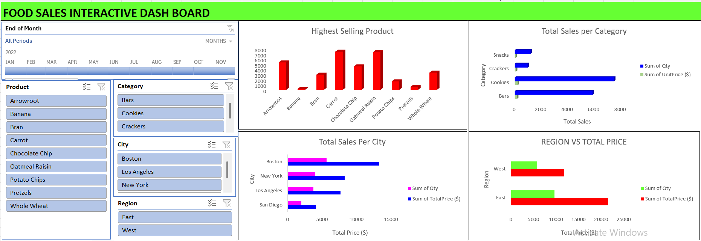

# Food Product Sales Insight
This Excel-based dashboard analyzes food product sales by category, city, and region over time. It offers stakeholders clear insights into sales trends, top-performing products, and revenue distribution, enabling smarter decisions in inventory management and targeted marketing strategies.

**Title:** [Food Product Sales Insight](https://github.com/Osiwi/github.io/blob/main/Food%20Sales%20Data%20Cleaned.xlsx)

**Tools & Technologies Used:** 
Microsoft Excel: Platform for building and analyzing the interactive sales dashboard.
Pivot Tables & Pivot Charts: Used to summarize total sales, quantities, and pricing by product, city, region, and category.
Slicers & Timeline Filters: Allow filtering by product, category, city, region, and time (monthly).
Bar and Column Charts: Visualize top-selling products, regional comparisons, and category performance.
Power Query (Get & Transform): Used for preparing raw food sales data for pivoting and analysis.
Conditional Formatting: Used to enhance data interpretation and highlight high-volume categories or regions.

**Project Description Overview:**
This Excel-based dashboard was designed to analyze and visualize food product sales across categories, cities, and regions over time. It provides business stakeholders with quick insights into sales trends, high-performing products, and revenue distribution thereby enabling smarter inventory and marketing strategies.

**Objective:**
To provide a detailed overview of food product sales by identifying best-selling items, top-performing cities, and regional revenue contributions—empowering food distributors and retailers with data-driven decision support.

**Key Features Included in the Dashboard:**
Highest Selling Product Chart: Column chart ranking food items by quantity sold.
Total Sales per Category: Bar chart comparing quantity and unit price contributions across food categories.
Sales by City: Bar chart breaking down total quantity and price by major cities like Boston, New York, and Los Angeles.
Region vs Total Price: Horizontal bar chart comparing East vs West regional performance in both sales volume and total revenue.
Interactive Filters: Slicers for product, category, city, region, and monthly timeline allow dynamic user-driven analysis.

**Key findings:**
Carrot and Oatmeal Raisin are the top-selling products, outperforming others in total quantity.
Cookies category leads in both quantity and unit price-based sales, followed by Bars.
Boston shows the highest total sales value, significantly ahead of other cities.
The East region contributes the highest revenue, but the West region shows higher average price per item, suggesting premium product positioning.
Sales peaked between May and July, indicating seasonal consumer behavior.
Summary:
This dashboard offers a comprehensive look into food sales trends, helping stakeholders identify where demand is strongest and which products or cities generate the most value. With interactive visuals and slicer-driven filtering, it is a powerful tool for both operational and strategic sales planning in the food distribution industry.

**Dashboard Overview:** 

